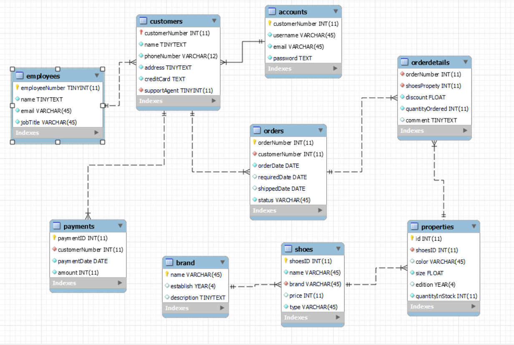

# web bán giày

-login use accounts
-when sign up new account will be created along with customer informations
-each brand has different shoes
-Each shoes has many combinations of color and size display in the properties table so that when the customers choose their products
the orderDetails will reference an id in the properties table for the specific color and size of a shoes that the buyer has chose
-After putting their desired products in the minicart and go to check out page, the web will fetch the informations of theirs shoes from the properties
table and display for the viewer to see.
-When click confirm in the checkOut page, new order will be created along with many orderDetails representing each shoes that the customers
put into their carts.